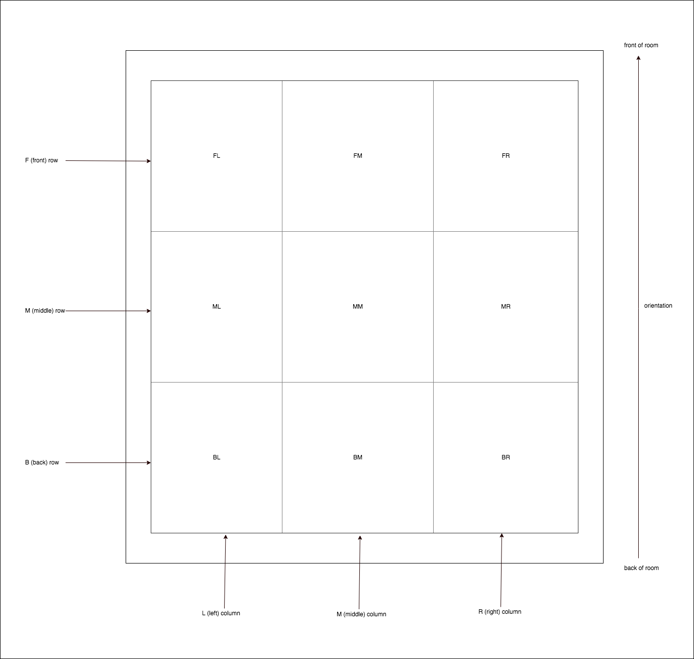
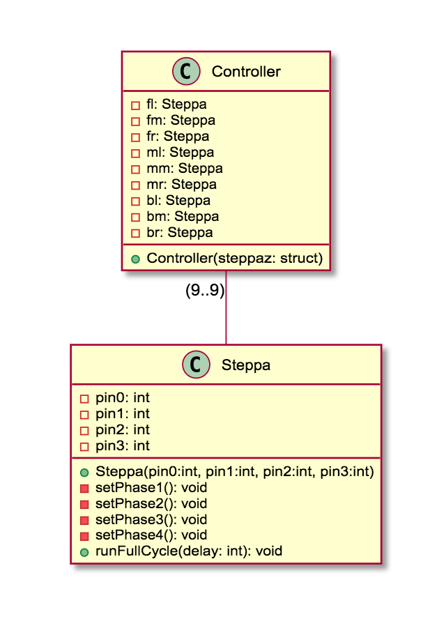

# Air Pollution Installation Servo System

> As the project is under development, this document is as well. Expect this to be continuously updated.

## Servo Mapping
In order to have individual control over each motor, we'll need to define of some kind of coördination system. Since we will have only nine motors, this can be as simple as the following:

## Class diagram
Great! We have labeled all the motors! Now we can think of software architecture. Below a class diagram is shown with a graphical (UML) representation of the classes we'll use to control this badboy.

### Human explanation
#### The Steppa class
This is the class we will use to control a single stepper motor. It knows about the pins it's wired to and can be used to set the motor to a certain speed.

#### The Controller class
We will use this class for easier control over all motors together.
